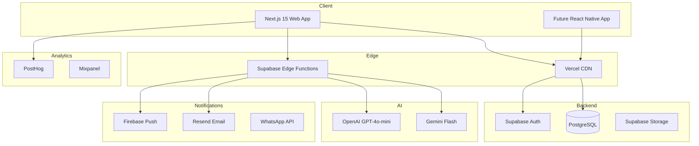
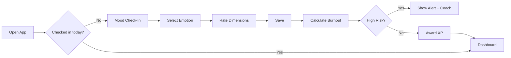
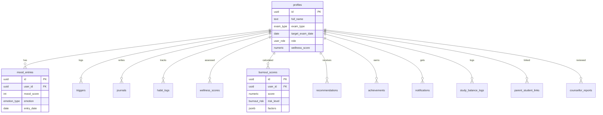
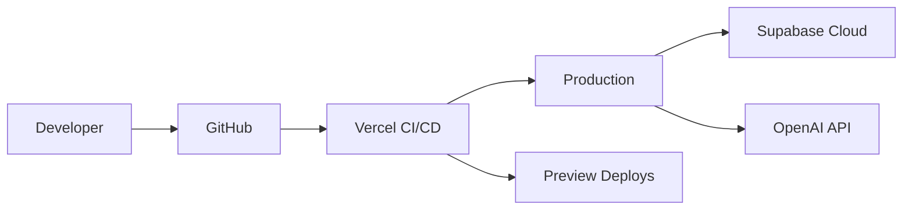

# SweatJoy — Product Architecture

## System Overview



## Information Architecture

```
SweatJoy
├── Welcome (/)
├── Auth
│   ├── Login (/login)
│   └── Sign Up (/signup)
├── Onboarding (/onboarding)
│   ├── Profile Setup
│   ├── Wellness Assessment
│   └── Wellness Plan
└── App (authenticated)
    ├── Dashboard (/dashboard)
    ├── Mood (/mood)
    ├── Journal (/journal)
    ├── Triggers (/triggers)
    ├── Habits (/habits)
    ├── Coach (/coach)
    ├── Balance (/balance)
    ├── Analytics (/analytics)
    └── Settings (/settings)
```

## User Flow — Daily Check-In



## Database ERD



## Deployment Architecture



## Security Architecture

- **Authentication:** Supabase Auth with JWT, Google/Apple OAuth
- **Authorization:** Row Level Security (RLS) on all user tables
- **API:** Zod validation on all endpoints
- **Audit:** audit_logs table for admin actions
- **Data:** Encryption at rest (Supabase), TLS in transit

## Tech Stack Summary

| Layer | Technology |
|-------|-----------|
| Frontend | Next.js 15, React 19, TypeScript, TailwindCSS, Shadcn UI |
| Backend | Supabase, PostgreSQL, Edge Functions |
| AI | OpenAI, Gemini |
| Analytics | PostHog, Mixpanel |
| Notifications | Firebase, Email, WhatsApp |
| Hosting | Vercel |
